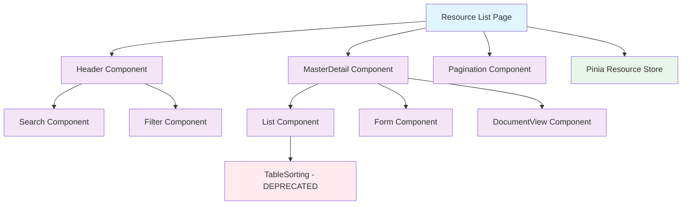

# Resource List Page Specification

The `[resource].vue` page is a **self-contained coordinator** that orchestrates self-contained child components to provide a comprehensive resource management interface. It determines the appropriate mode (form/document) and coordinates component interactions.

**File Location:** `frontend/app/pages/list/[resource].vue`


## TDD Requirements

**Test First Approach - Write these tests BEFORE implementation:**

```javascript
// frontend/tests/pages/list/[resource].spec.ts
describe('Resource List Page', () => {
  it('should determine mode (form/document) from menu configuration')
  it('should render Header component with appropriate actions')
  it('should coordinate MasterDetail component correctly')
  it('should handle pagination via Pagination component')
  it('should sync URL state across all components')
  it('should handle component mode switching')
  it('should manage global loading states')
  it('should integrate error handling across components')
  it('should use the centralized resource store for all list state (data, loading, error, sort, filters, pagination)')
  it('should not allow child components to fetch or manage their own data independently')
  it('should use useApiService for all HTTP requests via the store')
  it('should use useNotifyService for all notifications and error handling via the store')
})
```


## Page Architecture (Self-Contained Coordinator with Centralized Store)

```txt
[resource].vue Page (Self-Contained Coordinator)
├── Mode Determination
│   ├── Fetch menu configuration (via useApiService)
│   ├── Determine form vs document mode
│   └── Load appropriate components
├── Centralized State Management
│   ├── Use Pinia resource store (frontend/app/stores/resource.ts) for all list state
│   ├── All data, loading, error, sort, filters, pagination, columns, schema, etc. managed in store
│   └── No child component may fetch or manage its own data independently
├── Component Coordination
│   ├── Header component (actions, search, filters)
│   ├── MasterDetail component (main content)
│   ├── Pagination component (navigation)
│   └── Loading state management (from store)
├── URL State Management
│   ├── Route parameter extraction
│   ├── Query parameter coordination
│   ├── Browser history management
│   └── Component state synchronization
├── Global Event Handling
│   ├── Component event aggregation
│   ├── Cross-component communication
│   ├── Action coordination
│   └── Error boundary management
└── API/Notify Integration
    ├── All HTTP requests via useApiService (only in store)
    ├── All notifications and error handling via useNotifyService (only in store)
    └── Global error handling
```


## Component Relationships



## Mode Determination Logic

The page determines whether to use Form or DocumentView components based on menu configuration:

```typescript
// Mode determination from MenuController.php
interface MenuConfiguration {
  id: number
  name: string
  path: string
  icon: string
  mode: 'form' | 'doc' // Determines component mode
}

// Example configurations:
const menuConfigs = {
  form: {
    id: 60,
    name: 'Users',
    path: '/list/users',
    icon: 'bi-people',
    mode: 'form' // Uses Form component
  },
  document: {
    id: 40,
    name: 'Estimates',
    path: '/list/estimates', 
    icon: 'bi-receipt',
    mode: 'doc' // Uses DocumentView component
  }
}
```


## Implementation Example

```html
<!-- Resource List Page (with centralized Pinia store) -->
<template>
  <div class="resource-page">
    <!-- Global Loading State -->
    <div v-if="resourceStore.isLoading" class="initialization-loading">
      <div class="d-flex justify-content-center align-items-center min-vh-100">
        <div class="text-center">
          <div class="spinner-border text-primary mb-3" role="status">
            <span class="visually-hidden">Loading...</span>
          </div>
          <p class="text-muted">Initializing {{ resourceName }}...</p>
        </div>
      </div>
    </div>
    <!-- Main Content -->
    <div v-else class="resource-content">
      <!-- Page Header -->
      <Header
        :title="resourceTitle"
        :resource="resourceName"
        :show-create="canCreate"
        :show-export="canExport"
        :show-import="canImport"
        @action-triggered="handleHeaderAction"
      >
        <template #search>
          <Search
            :resource="resourceName"
            :initial-search="$route.query.search"
            @search-applied="handleSearchUpdate"
          />
        </template>
        <template #filters>
          <Filter
            :resource="resourceName"
            :initial-filters="getInitialFilters()"
            @filters-applied="handleFiltersUpdate"
          />
        </template>
      </Header>
      <!-- Main Content Area -->
      <div class="main-content">
        <MasterDetail
          :resource="resourceName"
          :mode="componentMode"
          :initial-selection="$route.params.id"
          @selection-changed="handleSelectionChanged"
        />
      </div>
      <!-- Pagination -->
      <div class="pagination-container">
        <Pagination
          :resource="resourceName"
          :initial-page="$route.query.page"
          :initial-per-page="$route.query.per_page"
          @page-changed="handlePageChanged"
        />
      </div>
    </div>
    <!-- Error Boundary -->
    <div v-if="resourceStore.hasError" class="error-boundary">
      <div class="alert alert-danger text-center">
        <i class="bi bi-exclamation-triangle me-2"></i>
        Failed to load {{ resourceName }}. 
        <button class="btn btn-link p-0" @click="retryInitialization">
          Try again
        </button>
      </div>
    </div>
  </div>
</template>

<script setup lang="ts">
import { computed } from 'vue'
import { useRoute, useRouter } from 'vue-router'
import { useResourceStore } from '@/stores/resource'
import Header from '@/components/Resource/Header.vue'
import MasterDetail from '@/components/Resource/MasterDetail.vue'
import Pagination from '@/components/Resource/Pagination.vue'
import Search from '@/components/Resource/Search.vue'
import Filter from '@/components/Resource/Filter.vue'

const route = useRoute()
const router = useRouter()
const resourceStore = useResourceStore()

const resourceName = computed(() => route.params.resource as string)
const resourceTitle = computed(() => resourceName.value.charAt(0).toUpperCase() + resourceName.value.slice(1))
const componentMode = computed(() => resourceStore.schema?.mode === 'doc' ? 'document' : 'form')
const canCreate = computed(() => resourceStore.schema?.permissions?.create !== false)
const canExport = computed(() => resourceStore.schema?.permissions?.export !== false)
const canImport = computed(() => resourceStore.schema?.permissions?.import !== false)

// All event handlers should call store actions or update store state only
const handleHeaderAction = (payload: { action: string; data?: any }) => {
  switch (payload.action) {
    case 'create':
      router.push({ name: `${resourceName.value}-create`, params: { resource: resourceName.value } })
      break
    case 'export':
      resourceStore.setMessage('Export initiated')
      break
    case 'import':
      resourceStore.setMessage('Import initiated')
      break
    case 'refresh':
      resourceStore.fetchData({ resource: resourceName.value })
      break
  }
}

const handleSearchUpdate = (payload: { search: string; hasResults: boolean }) => {
  resourceStore.setSearch(payload.search)
  if (payload.search && !payload.hasResults) {
    resourceStore.setMessage(`No results found for "${payload.search}"`)
  }
}

const handleFiltersUpdate = (payload: { filters: object; hasActiveFilters: boolean }) => {
  resourceStore.setFilters(payload.filters)
  if (payload.hasActiveFilters) {
    resourceStore.setMessage('Filters applied')
  }
}

const handleSelectionChanged = (payload: { selectedItem: any }) => {
  if (payload.selectedItem) {
    router.push({ params: { ...route.params, id: payload.selectedItem.id }, query: route.query })
  } else {
    const { id, ...params } = route.params
    router.push({ params, query: route.query })
  }
}

const handlePageChanged = (payload: { page: number; perPage: number; totalItems: number }) => {
  resourceStore.setPagination(payload.page, payload.perPage)
}

const getInitialFilters = () => {
  const filters: Record<string, any> = {}
  Object.entries(route.query).forEach(([key, value]) => {
    if (!['page', 'per_page', 'search', 'sort', 'dir'].includes(key)) {
      filters[key] = value
    }
  })
  return filters
}

const retryInitialization = () => {
  resourceStore.fetchData({ resource: resourceName.value })
}
</script>

<style scoped>
.resource-page {
  min-height: 100vh;
  display: flex;
  flex-direction: column;
}

.main-content {
  flex: 1;
  overflow: hidden;
}

.pagination-container {
  border-top: 1px solid var(--bs-border-color);
  background-color: var(--bs-light);
  padding: 1rem;
}

.initialization-loading {
  position: fixed;
  top: 0;
  left: 0;
  right: 0;
  bottom: 0;
  background-color: rgba(255, 255, 255, 0.9);
  z-index: 9999;
}

.error-boundary {
  position: sticky;
  bottom: 0;
  z-index: 1000;
}
</style>
```

## Key Features


### Self-Contained Architecture with Centralized Store
- **Centralized State**: All resource list state (data, loading, error, sort, filters, pagination, columns, schema, etc.) is managed in the Pinia resource store (`frontend/app/stores/resource.ts`).
- **No Data Fetching in Components**: Child components must not fetch or manage their own data; they read/write state directly from the store.
- **Minimal Props**: Components require minimal configuration from parent, and receive state via store.
- **Event Coordination**: Page coordinates high-level events and updates store state; components do not manage API or notify logic.

### Mode Determination
- **Dynamic Loading**: Determines form vs document mode from menu configuration (fetched via store action)
- **Component Switching**: Loads appropriate components based on resource type
- **API Integration**: All HTTP requests via `useApiService` in the store only

### URL State Management
- **Automatic Synchronization**: Child components sync their state with URL via store
- **Browser Navigation**: Full support for back/forward navigation
- **Bookmarkable State**: All component states can be bookmarked and shared

### Error Handling
- **Store-Level**: All error and notification handling is managed in the store using `useNotifyService`
- **Component-Level**: Components display error state from store, but do not handle errors directly
- **Page-Level**: Global error boundary for initialization failures (from store)
- **User Feedback**: Comprehensive notification system via store

## API Integration Reference


**Endpoints Used:**
- **Menu Config:** `GET /api/v1/menu/configuration/{resource}` (via store)
- **Permissions:** `GET /api/v1/permissions/{resource}` (via store)

**All API calls and error handling must be performed in the Pinia resource store using `useApiService` and `useNotifyService`.**

**Child components must not perform their own API calls or error handling.**

---

**Migration from Old Architecture:**
This page replaces the previous prop-heavy approach with self-contained components that manage their own state and API interactions, resulting in better performance, maintainability, and user experience.
