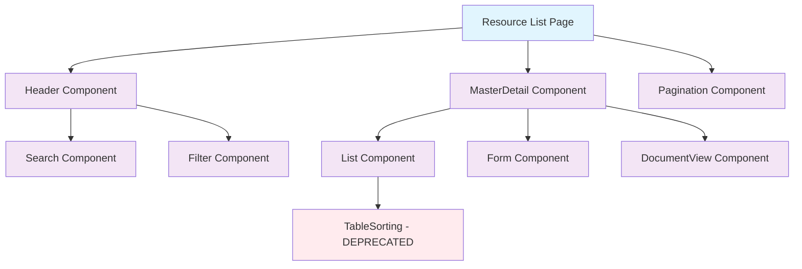

# Resource List Page Design Specification

This document outlines the design and functionality of the `[resource].vue` page, ensuring consistency with the BOS frontend standards.

**File Location:** `frontend/app/pages/list/[resource].vue`


## TDD Requirements

**Test First Approach - Write these tests BEFORE implementation:**

```javascript
// frontend/tests/pages/list/[resource].spec.ts
describe('Resource List Page', () => {
  it('should determine mode (form/document) from menu configuration')
  it('should render Header component with appropriate actions')
  it('should coordinate MasterDetail component correctly')
  it('should handle pagination via Pagination component')
  it('should sync URL state across all components')
  it('should handle component mode switching')
  it('should manage global loading states')
  it('should integrate error handling across components')
})
```

## Page Architecture (Self-Contained Coordinator)

```txt
[resource].vue Page (Self-Contained Coordinator)
├── Mode Determination
│   ├── Fetch menu configuration
│   ├── Determine form vs document mode
│   └── Load appropriate components
├── Component Coordination
│   ├── Header component (actions, search, filters)
│   ├── MasterDetail component (main content)
│   ├── Pagination component (navigation)
│   └── Loading state management
├── URL State Management
│   ├── Route parameter extraction
│   ├── Query parameter coordination
│   ├── Browser history management
│   └── Component state synchronization
├── Global Event Handling
│   ├── Component event aggregation
│   ├── Cross-component communication
│   ├── Action coordination
│   └── Error boundary management
└── API Integration (useApiService)
    ├── Menu configuration fetch
    ├── Mode determination logic
    └── Global error handling
```

## Component Relationships



## Mode Determination Logic

The page determines whether to use Form or DocumentView components based on menu configuration:

```typescript
// Mode determination from MenuController.php
interface MenuConfiguration {
  id: number
  name: string
  path: string
  icon: string
  mode: 'form' | 'doc' // Determines component mode
}

// Example configurations:
const menuConfigs = {
  form: {
    id: 60,
    name: 'Users',
    path: '/list/users',
    icon: 'bi-people',
    mode: 'form' // Uses Form component
  },
  document: {
    id: 40,
    name: 'Estimates',
    path: '/list/estimates', 
    icon: 'bi-receipt',
    mode: 'doc' // Uses DocumentView component
  }
}
```

## Implementation Example

```html
<!-- Resource List Page -->
<template>
  <div class="resource-page">
    <!-- Global Loading State -->
    <div v-if="isInitializing" class="initialization-loading">
      <div class="d-flex justify-content-center align-items-center min-vh-100">
        <div class="text-center">
          <div class="spinner-border text-primary mb-3" role="status">
            <span class="visually-hidden">Loading...</span>
          </div>
          <p class="text-muted">Initializing {{ resourceName }}...</p>
        </div>
      </div>
    </div>
    
    <!-- Main Content -->
    <div v-else class="resource-content">
      <!-- Page Header -->
      <Header
        :title="resourceTitle"
        :resource="resourceName"
        :show-create="canCreate"
        :show-export="canExport"
        :show-import="canImport"
        @action-triggered="handleHeaderAction"
      >
        <template #search>
          <Search
            :resource="resourceName"
            :initial-search="$route.query.search"
            @search-applied="handleSearchUpdate"
          />
        </template>
        
        <template #filters>
          <Filter
            :resource="resourceName"
            :initial-filters="getInitialFilters()"
            @filters-applied="handleFiltersUpdate"
          />
        </template>
      </Header>
      
      <!-- Main Content Area -->
      <div class="main-content">
        <MasterDetail
          :resource="resourceName"
          :mode="componentMode"
          :initial-selection="$route.params.id"
          @selection-changed="handleSelectionChanged"
        />
      </div>
      
      <!-- Pagination -->
      <div class="pagination-container">
        <Pagination
          :resource="resourceName"
          :initial-page="$route.query.page"
          :initial-per-page="$route.query.per_page"
          @page-changed="handlePageChanged"
        />
      </div>
    </div>
    
    <!-- Error Boundary -->
    <div v-if="hasGlobalError" class="error-boundary">
      <div class="alert alert-danger text-center">
        <i class="bi bi-exclamation-triangle me-2"></i>
        Failed to load {{ resourceName }}. 
        <button class="btn btn-link p-0" @click="retryInitialization">
          Try again
        </button>
      </div>
    </div>
  </div>
</template>

<script setup lang="ts">
import { ref, computed, onMounted, watch } from 'vue'
import { useRoute, useRouter } from 'vue-router'
import { useApiService } from '@/utils/api'
import { useNotifyService } from '@/utils/notify'

import Header from '@/components/Resource/Header.vue'
import MasterDetail from '@/components/Resource/MasterDetail.vue'
import Pagination from '@/components/Resource/Pagination.vue'
import Search from '@/components/Resource/Search.vue'
import Filter from '@/components/Resource/Filter.vue'

// Route and services
const route = useRoute()
const router = useRouter()
const apiService = useApiService()
const notifyService = useNotifyService()

// Reactive state
const isInitializing = ref(true)
const hasGlobalError = ref(false)
const menuConfiguration = ref<any>(null)
const resourcePermissions = ref<any>({})

// Computed properties
const resourceName = computed(() => route.params.resource as string)

const resourceTitle = computed(() => 
  resourceName.value.charAt(0).toUpperCase() + resourceName.value.slice(1)
)

const componentMode = computed(() => {
  return menuConfiguration.value?.mode === 'doc' ? 'document' : 'form'
})

const canCreate = computed(() => 
  resourcePermissions.value.create !== false
)

const canExport = computed(() => 
  resourcePermissions.value.export !== false
)

const canImport = computed(() => 
  resourcePermissions.value.import !== false
)

// Initialize page
onMounted(() => {
  initializePage()
})

const initializePage = async () => {
  try {
    isInitializing.value = true
    hasGlobalError.value = false
    
    // Fetch menu configuration to determine mode
    const menuResponse = await apiService.get('menu/configuration', resourceName.value)
    menuConfiguration.value = menuResponse.data
    
    // Fetch resource permissions
    const permissionsResponse = await apiService.get('permissions', resourceName.value)
    resourcePermissions.value = permissionsResponse.data || {}
    
    // Page is ready
    isInitializing.value = false
    
  } catch (error) {
    handleGlobalError('Failed to initialize page', error)
  }
}

// Event handlers
const handleHeaderAction = (payload: { action: string; data?: any }) => {
  switch (payload.action) {
    case 'create':
      navigateToCreate()
      break
    case 'export':
      notifyService.info('Export initiated')
      break
    case 'import':
      notifyService.info('Import initiated')
      break
    case 'refresh':
      refreshPageData()
      break
  }
}

const handleSearchUpdate = (payload: { search: string; hasResults: boolean }) => {
  // Search state is automatically managed by Search component
  // This handler can be used for analytics or additional coordination
  if (payload.search && !payload.hasResults) {
    notifyService.info(`No results found for "${payload.search}"`)
  }
}

const handleFiltersUpdate = (payload: { filters: object; hasActiveFilters: boolean }) => {
  // Filter state is automatically managed by Filter component
  // This handler can be used for analytics or additional coordination
  if (payload.hasActiveFilters) {
    notifyService.success('Filters applied')
  }
}

const handleSelectionChanged = (payload: { selectedItem: any }) => {
  // Update URL to reflect selection
  if (payload.selectedItem) {
    router.push({
      params: { ...route.params, id: payload.selectedItem.id },
      query: route.query
    })
  } else {
    const { id, ...params } = route.params
    router.push({ params, query: route.query })
  }
}

const handlePageChanged = (payload: { page: number; perPage: number; totalItems: number }) => {
  // Pagination state is automatically managed by Pagination component
  // This handler can be used for analytics or additional coordination
}

// Navigation helpers
const navigateToCreate = () => {
  router.push({
    name: `${resourceName.value}-create`,
    params: { resource: resourceName.value }
  })
}

// Utility functions
const getInitialFilters = () => {
  const filters: Record<string, any> = {}
  
  // Extract filter parameters from URL
  Object.entries(route.query).forEach(([key, value]) => {
    if (!['page', 'per_page', 'search', 'sort', 'dir'].includes(key)) {
      filters[key] = value
    }
  })
  
  return filters
}

const refreshPageData = () => {
  // Child components will handle their own refresh
  notifyService.info('Refreshing data...')
}

const retryInitialization = () => {
  initializePage()
}

// Error handling
const handleGlobalError = (message: string, error: any) => {
  console.error('[ResourcePage]', message, error)
  hasGlobalError.value = true
  isInitializing.value = false
  notifyService.error(message)
}

// Watch for route changes
watch(() => route.params.resource, (newResource) => {
  if (newResource !== resourceName.value) {
    initializePage()
  }
})

// Meta information for the page
useHead({
  title: computed(() => `${resourceTitle.value} - BOS`),
  meta: [
    {
      name: 'description',
      content: computed(() => `Manage ${resourceTitle.value} in BOS application`)
    }
  ]
})
</script>

<style scoped>
.resource-page {
  min-height: 100vh;
  display: flex;
  flex-direction: column;
}

.main-content {
  flex: 1;
  overflow: hidden;
}

.pagination-container {
  border-top: 1px solid var(--bs-border-color);
  background-color: var(--bs-light);
  padding: 1rem;
}

.initialization-loading {
  position: fixed;
  top: 0;
  left: 0;
  right: 0;
  bottom: 0;
  background-color: rgba(255, 255, 255, 0.9);
  z-index: 9999;
}

.error-boundary {
  position: sticky;
  bottom: 0;
  z-index: 1000;
}
</style>
```

## Key Features

### Self-Contained Architecture
- **Component Isolation**: Each child component manages its own state and API calls
- **Minimal Props**: Components require minimal configuration from parent
- **Event Coordination**: Page coordinates high-level events without managing component internals

### Mode Determination
- **Dynamic Loading**: Determines form vs document mode from menu configuration
- **Component Switching**: Loads appropriate components based on resource type
- **API Integration**: Fetches mode configuration from `MenuController.php`

### URL State Management
- **Automatic Synchronization**: Child components sync their state with URL
- **Browser Navigation**: Full support for back/forward navigation
- **Bookmarkable State**: All component states can be bookmarked and shared

### Error Handling
- **Component-Level**: Each component handles its own errors
- **Page-Level**: Global error boundary for initialization failures
- **User Feedback**: Comprehensive notification system

## API Integration Reference

**Endpoints Used:**
- **Menu Config:** `GET /api/v1/menu/configuration/{resource}`
- **Permissions:** `GET /api/v1/permissions/{resource}`

**Child Component APIs:** Inherited from individual component specifications

**Error Handling:** Coordinated via `frontend/app/utils/notify.ts`

## Test-Driven Development (TDD)

For detailed TDD guidelines, refer to the [BOS Frontend Rules](design/rules-app.md).